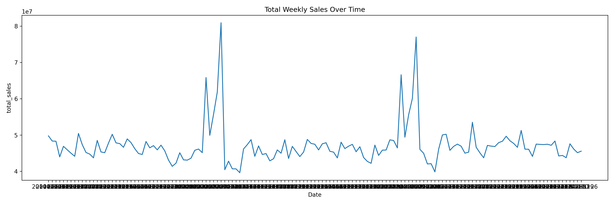
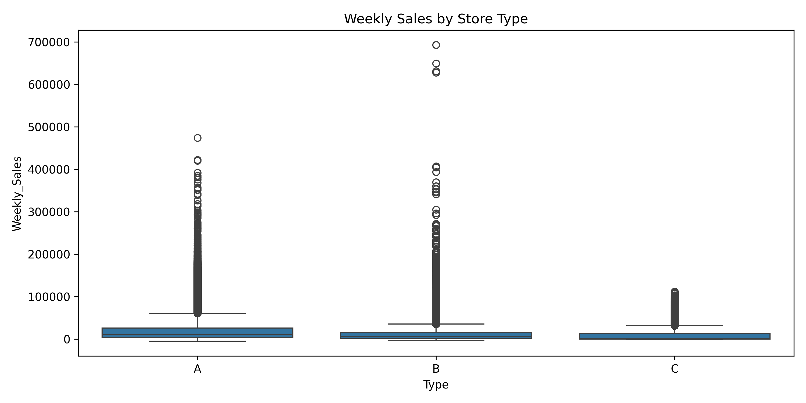
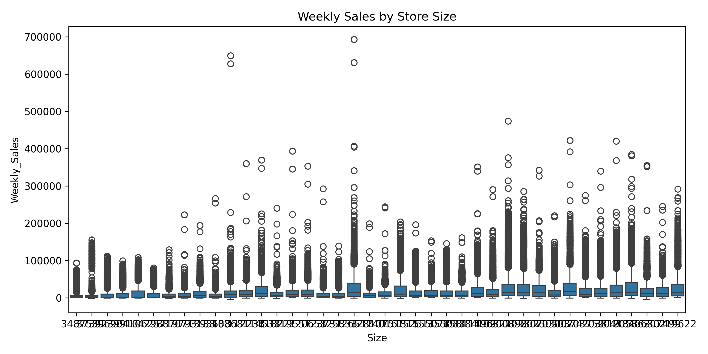
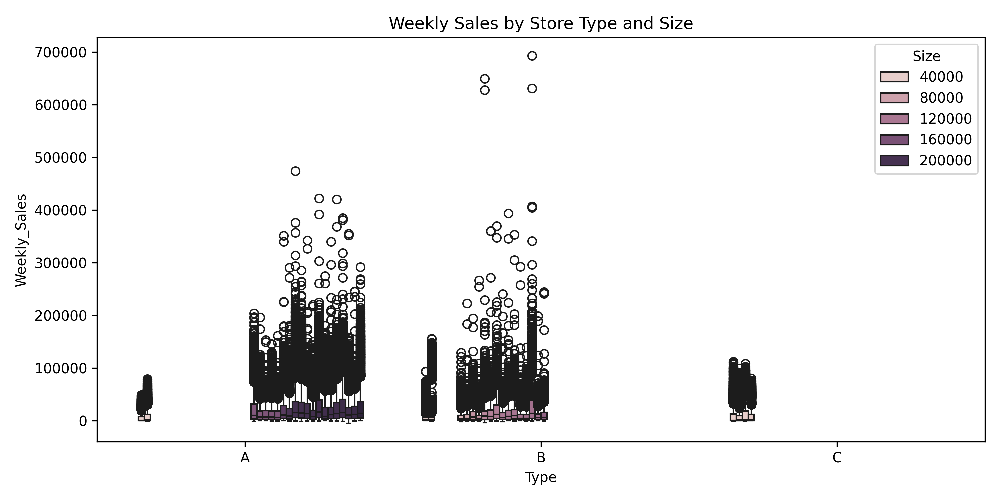

# Retail Demand Forecasting

A data engineering and analytics pipeline for processing multi-source retail sales data, integrating PostgreSQL for structured storage and SQL-based querying with pandas and PySpark for transformation and analysis.

[](https://www.python.org/)
[](https://spark.apache.org/)
[](https://pandas.pydata.org/)
[](LICENSE)

---

## Table of Contents
- [Overview](#overview)
- [Pipeline Architecture](#pipeline-architecture)
- [Key Features](#key-features)
- [Data Sources](#data-sources)
- [Setup](#setup)
- [Usage](#usage)
- [SQL Integration](#sql-integration)
- [Validation](#validation)
- [Results](#results)
- [Output Structure](#output-structure)
- [Technologies](#technologies)
- [Project Focus](#project-focus)
- [Limitations](#limitations)
- [License](#license)
- [Contact](#contact)

---

## Overview

This project processes 421,000+ rows of Walmart retail sales data from multiple sources. It implements a validation-first pipeline that verifies data quality before transformation and analysis.

The pipeline combines:
- Relational data storage in PostgreSQL
- SQL-based joins, aggregations, and window queries
- In-memory analytics with pandas
- Distributed processing with PySpark

---

## Pipeline Architecture

```text
Raw CSV Files (train, test, features, stores)
        |
        v
PostgreSQL (via SQLAlchemy)
        |
        v
Validation Layer
  - Schema validation
  - Row count integrity
  - Null detection
  - Duplicate checks
        |
        v
Transformation Layer
  - SQL joins across multiple tables
  - Aggregations and time-series queries
        |
        v
Analysis Layer
  - pandas (EDA and visualization)
  - PySpark (distributed processing)
        |
        v
Outputs (reports, visualizations, statistics)
```

---

## Key Features

- Multi-source ETL pipeline combining sales, economic indicators, and store metadata
- PostgreSQL integration for structured storage and query-based access
- SQL-based joins for multi-table integration
- Aggregation queries for time-series and store-level analysis
- Window functions for store-level comparative analysis
- Validation-first design for data integrity checks
- Dual processing paths using pandas and PySpark

---

## Data Sources

| Dataset | Records | Columns |
|---------|---------|---------|
| train.csv | 421,570 | Store, Dept, Date, Weekly_Sales, IsHoliday |
| test.csv | 115,064 | Store, Dept, Date, IsHoliday |
| features.csv | 8,190 | Store, Date, Temperature, Fuel_Price, MarkDowns, CPI, Unemployment |
| stores.csv | 45 | Store, Type, Size |

Source: Walmart Recruiting - Store Sales Forecasting (Kaggle)

---

## Setup

### Requirements

- Python 3.8+
- PostgreSQL
- Java 8 or 11 (for PySpark)

### Installation

```bash
git clone https://github.com/MercuryConnor/Retail-Demand-Forecasting.git
cd Retail-Demand-Forecasting
python -m venv .venv

# Windows
.venv\Scripts\activate

# macOS/Linux
source .venv/bin/activate

pip install -r requirements.txt
```

### Database Setup

1. Create a PostgreSQL database named retail_db.
2. Update database credentials in db_setup.py or provide them through environment configuration.
3. Load source files into PostgreSQL:

```bash
python db_setup.py
```

This loads:
- train -> train table
- test -> test table
- features -> features table
- stores -> stores table

---

## Usage

Run notebooks in order:

```text
01_eda_exploration.ipynb
02_eda_pysparkk.ipynb
```

Pipeline steps performed:
- Data loading from CSV and/or PostgreSQL
- Validation checks
- SQL-based joins and aggregations
- Visualization and summary statistics generation

---

## SQL Integration

### Example: Multi-table join

```sql
SELECT 
    t."Store",
    t."Dept",
    t."Date",
    t."Weekly_Sales",
    f."Temperature",
    f."Fuel_Price",
    s."Type",
    s."Size"
FROM train t
LEFT JOIN features f 
    ON t."Store" = f."Store" AND t."Date" = f."Date"
LEFT JOIN stores s 
    ON t."Store" = s."Store";
```

### Example: Aggregation

```sql
SELECT 
    "Date",
    SUM("Weekly_Sales") AS total_sales
FROM train
GROUP BY "Date"
ORDER BY "Date";
```

### Example: Window Function

```sql
SELECT 
    "Store",
    "Weekly_Sales",
    AVG("Weekly_Sales") OVER (PARTITION BY "Store") AS avg_store_sales
FROM train;
```

---

## Validation

The pipeline includes validation checks before transformation:
- Schema validation across datasets
- Row count verification after joins
- Null value detection in critical fields
- Duplicate detection for Store-Dept-Date combinations

Example validation output:

```text
Train rows: 421,570
Merged rows: 421,570
Join integrity validated
No nulls in Weekly_Sales
No duplicate Store-Dept-Date combinations
```

---

## Results

### Pipeline Results Summary

| Metric | Value |
|--------|-------|
| Records processed | 421,570 |
| Join integrity | Preserved (no row loss) |
| Critical null checks | Passed |
| Duplicate key checks | Passed |
| Output reports generated | validation_report.txt, summary_statistics.csv |
| Visualization files generated | 4 PNG files |

### Visualizations

**Total Weekly Sales Over Time**



**Sales by Store Type**



**Sales by Store Size**



**Sales by Store Type and Size**



---

## Output Structure

```text
outputs/
|-- validation_report.txt
|-- 01_sales_over_time.png
|-- 02_sales_by_store_type.png
|-- 03_sales_by_store_size.png
|-- 04_sales_by_type_and_size.png
|-- summary_statistics.csv
`-- pyspark/
    |-- pyspark_validation_report.txt
    `-- processed_data_sample.csv
```

---

## Technologies

| Technology | Purpose |
|-----------|---------|
| Python | Core language |
| PostgreSQL | Data storage |
| SQL | Querying and transformations |
| SQLAlchemy | Database connectivity |
| Pandas | In-memory analysis |
| PySpark | Distributed processing |
| Matplotlib | Visualization |
| Seaborn | Statistical plotting |

---

## Project Focus

- Data engineering pipeline design
- Validation-first data processing
- SQL-based analytics integration
- Multi-source data modeling
- Preparation of analytics-ready datasets

---

## Limitations

- Notebook-based execution
- No orchestration or scheduling
- Local PostgreSQL instance
- No automated CI/CD pipeline

---

## License

This project is licensed under the MIT License. See LICENSE for details.

---

## Contact

Project Maintainer: Mrityunjay Chauhan  
Email: mrityunjaychauhan0102@gmail.com  
LinkedIn: https://www.linkedin.com/in/mrityunjay-chauhan-5b1813265/
